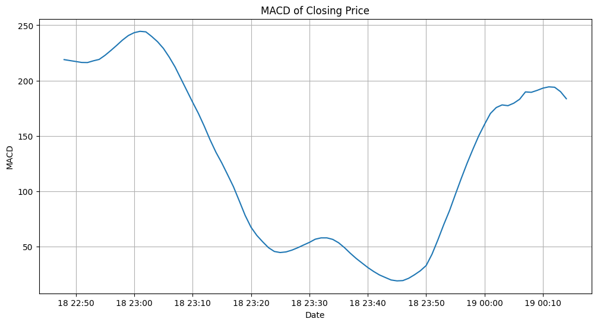
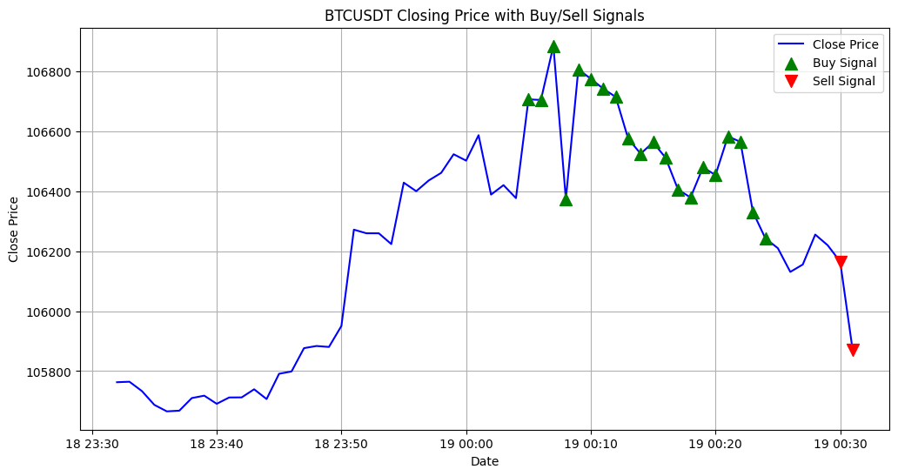

markdown

# Binance Trading Bot Prototype

A multi-asset crypto trading bot that uses technical indicators such as MACD to automate trading on Binance. This bot fetches historical data, applies trading logic, and simulates or executes trades on the Binance Testnet.

## Project Structure
  ```
  binance_trading_bot/
  ├── main_agent/
  │   ├── __init__.py
  │   ├── __main__.py
  │   ├── data_fetcher.py
  │   ├── indicators.py
  │   ├── trade_logic.py
  │   └── run.py
  ├── data/
  │   ├── assets.csv
  │   ├── assets.txt
  ├── README.md
  ├── setup.py
  └── requirements.txt
  ```

## Demo






## Features

- Fetches historical 1-minute bars from Binance
- Calculates MACD and percentage price change indicators
- Determines buy/sell signals based on the trading strategy
- Supports multiple assets
- Interactive setup for API keys and asset configurations
- Option to import asset data from .csv or .txt files


## Setup
1. Clone the repository:
  ```sh
  git clone https://github.com/yourusername/binance-assets-agent-macd.git
  cd binance-assets-agent-macd
  ```
## Installation
2. Install the required packages:
  ```sh
  pip install -r requirements.txt
  ```

3. Configure your Binance API keys in a `.env` file:
  ```
  BINANCE_API_KEY=your_api_key
  BINANCE_API_SECRET=your_api_secret
  ```

## Usage
### Running the Bot
1. Ensure you have your Binance API key and secret ready.
2. Run the bot:
  ```sh
  python -m main_agent
  ```
3.Follow the prompts to enter your API information and configure your assets.

### Importing Assets from a File
1. Place your assets.csv or assets.txt file in the data/ directory.
2. The file should have the following structure:
  ```
  asset,is_long,order_size
  BTC,False,[size]
  LTC,False,100
  TRX,False,1000
  ETH,False,0.0003
  BNB,False,0.0025
  XRP,False,100
  ```
3. Run the bot and choose the option to import assets from the file.


## License
This project is licensed under the MIT License.

## Acknowledgements

### Binance API
A big thanks to the [Binance API](https://github.com/sammchardy/python-binance) project which provides a comprehensive Python API for the Binance trading platform. 

Here's a quick example of how to use the Binance API to fetch account information:
  ```python
  from binance.client import Client
  
  api_key = 'your_api_key'
  api_secret = 'your_api_secret'
  client = Client(api_key, api_secret, testnet=True)
  
  # Get account information
  account_info = client.get_account()
  print(account_info)
  ```

## Contact
For any questions or suggestions, please open an issue or contact me at this project!

Thank you for using the Binance Trading Bot! Happy trading! 📈
